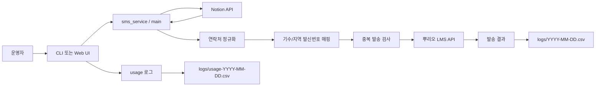

# 백엔드 / AI 협업형 개발자 포트폴리오

> 이름: [이름 입력]  
> 희망 직무: 백엔드 개발자, AI 협업형 백엔드 개발자, 업무 자동화 백엔드 개발자  
> GitHub: [GitHub 링크 입력]  
> Email: [이메일 입력]  
> Blog/Notion: [기술 블로그 또는 포트폴리오 링크 입력]

## 자기소개

저는 반복되는 운영 업무를 코드로 줄이고, 외부 API와 데이터를 안정적으로 연결하는 백엔드 개발자를 목표로 하고 있습니다. 플레이데이터평생교육원의 `풀스택 백엔드 개발자 양성 과정 6기`를 6개월간 수료하며 웹 서비스 개발의 전체 흐름을 익혔고, 최근에는 AI 코딩 도구를 활용해 요구사항 분석, 구현, 테스트, 회고까지 빠르게 반복하는 개발 방식에 관심을 두고 있습니다.

기계설계공학 전공 시절에는 캡스톤 디자인으로 사람 추적 자동차를 제작했습니다. 3D 프린터와 기구물을 활용해 차체를 만들고, 라이다 센서와 카메라 센서로 주변 환경을 인식했으며, Python 기반 딥러닝으로 사람, 고양이, 강아지, 기타 장애물을 분류했습니다. 이후 Arduino로 모터 제어를 구현해 사람이 인식되면 차량이 자동으로 따라 움직이도록 만들었습니다. 이 경험을 통해 현실의 제약을 소프트웨어로 해결하는 감각을 익혔고, 지금은 이 문제 해결력을 백엔드 서비스와 자동화 시스템 개발에 연결하고 있습니다.

SQLD 자격증을 취득했으며, 정보처리기사 필기 합격 후 실기 결과를 기다리고 있습니다.

## 핵심 역량

- Backend: Python, REST API 연동, 외부 서비스 인증, 예외 처리, 로그 설계
- Data & DB: SQLD 기반 SQL 이해, 데이터 정규화, CSV 기반 운영 로그 관리
- Automation: Notion API 기반 데이터 조회, LMS 발송 자동화, 중복 처리 자동화
- Testing: pytest, monkeypatch, mock 기반 외부 API 테스트, 예외 케이스 검증
- AI Collaboration: AI 도구를 활용한 요구사항 분해, 테스트 케이스 도출, 구현 반복, 코드 리뷰
- Hardware/IoT 경험: Python 딥러닝, 라이다/카메라 센서, Arduino 모터 제어, 3D 프린팅

## 대표 프로젝트 1. Interview SMS

### 프로젝트 개요

`Interview SMS`는 인터뷰 예정자에게 LMS 안내 문자를 발송하기 위한 Python 기반 자동화 서비스입니다. 노션에 등록된 당일 인터뷰 예정자를 조회하고, 연락처를 정규화한 뒤, 기수 또는 지역 키워드에 맞는 발신번호를 매핑해 뿌리오 API로 LMS를 발송합니다. 발송 결과는 CSV로 남기며, 같은 날 이미 성공 발송된 번호는 자동으로 제외합니다.

초기에는 콘솔 스크립트로 시작했지만, 여러 운영자가 브라우저에서 사용할 수 있도록 표준 라이브러리 기반 웹 프로그램까지 확장했습니다. 웹 화면에서는 사용자 이름 입력, 발송 미리보기, 체크박스 기반 대상 선택, 발송 결과 확인, 사용 이력 조회가 가능합니다.

### 문제 정의

인터뷰 안내 문자는 발송 대상, 발신번호, 날짜, 중복 여부에 따라 실수가 발생하기 쉬운 운영 업무입니다. 특히 노션의 기수 필드가 `SFAC 동작 33기`, `플레이데이터 서초 수강생`처럼 일정하지 않게 입력될 수 있어 정확 일치 방식으로는 안정적인 자동화가 어렵습니다.

이 프로젝트에서는 다음 문제를 해결하는 데 초점을 맞췄습니다.

- 노션의 당일 인터뷰 예정자를 KST 기준으로 정확히 조회
- 다양한 연락처 형식을 `01012345678` 형태로 정규화
- 기수/지역 필드에 키워드가 포함되어 있으면 발신번호 자동 매핑
- 오늘 이미 성공 발송된 번호는 재발송하지 않도록 중복 방지
- API 실패, 연락처 오류, 매핑 실패를 발송 전체 실패로 만들지 않고 건별 처리
- 운영자가 실제 발송 전에 미리보기와 수동 확인을 거치도록 설계

### 사용 기술

- Language: Python
- API: Notion API, 뿌리오 LMS API
- Web: `http.server`, `ThreadingHTTPServer`, HTML/CSS
- Config: `python-dotenv`, `.env`
- Logging: CSV, UTF-8-BOM, KST 날짜 기준 로그
- Test: pytest, unittest.mock, monkeypatch
- Collaboration: AI 코딩 도구를 활용한 PRD/FRD/TRD 기반 구현 및 테스트 반복

### 주요 기능

- 노션 데이터소스 API에서 오늘 인터뷰 예정자 조회
- KST 기준 오늘 00:00부터 다음 날 00:00 전까지 날짜 필터 생성
- 노션 페이지네이션 처리
- 연락처 정규화 및 `+82` 형식 처리
- 연락처 형식 오류 건은 `형식오류`로 기록 후 다음 건 진행
- `COHORT_SENDER_MAP` 기반 포함 방식 발신번호 매핑
- 매핑 실패 시 `매핑없음`으로 기록 후 다음 건 진행
- 뿌리오 토큰 발급 후 Bearer 인증으로 LMS 발송
- 뿌리오 허용 IP 오류를 별도 메시지로 안내
- 당일 성공 발송 이력 기준 중복 발송 방지
- 발송 결과를 `logs/YYYY-MM-DD.csv`에 기록
- 웹 사용 이력을 `logs/usage-YYYY-MM-DD.csv`에 기록
- 웹 UI에서 발송 대상 체크 선택 및 결과 확인
- 동시 발송 충돌을 줄이기 위한 발송 락 적용

### 백엔드 설계 포인트

#### 1. 설정 변경 범위 최소화

발신번호 추가와 변경은 `config.py`의 `COHORT_SENDER_MAP`만 수정하도록 설계했습니다. 운영자가 신규 지역이나 기수를 추가할 때 여러 파일을 건드리지 않게 하여 설정 실수 가능성을 줄였습니다.

```python
COHORT_SENDER_MAP = {
    "동작": "010-6775-7302",
    "서초": "010-2532-7302",
    "G밸리": "010-2598-7302",
}
```

`resolve_cohort()`는 정확 일치가 아니라 포함 방식으로 동작합니다. 덕분에 노션 필드가 `SFAC 동작 33기`처럼 입력되어도 `"동작"` 키로 안정적으로 매핑됩니다.

#### 2. 발송 안전장치

문자 발송은 실제 비용과 사용자 경험에 영향을 주는 작업이므로 완전 자동 발송으로 만들지 않았습니다. 콘솔에서는 미리보기 후 제외할 번호를 입력하고 최종 Y/N 확인을 거치며, 웹에서는 체크박스로 발송 대상을 선택하도록 했습니다.

이미 성공 발송된 번호는 당일 로그를 기준으로 `중복건너뜀` 처리합니다. 반면 실패나 형식 오류는 성공 발송 기록이 아니므로 재실행 시 다시 처리할 수 있습니다.

#### 3. 외부 API 실패 격리

노션 API 조회 실패는 전체 발송 대상 자체를 알 수 없는 상황이므로 실패 로그를 남기고 종료하도록 처리했습니다. 반대로 개별 LMS 발송 실패, 발신번호 매핑 실패, 연락처 형식 오류는 해당 건만 실패 처리하고 나머지 대상은 계속 처리하도록 설계했습니다.

뿌리오 API의 허용 IP 오류는 운영자가 바로 조치할 수 있도록 `실패(허용IP)`와 구체적인 안내 메시지로 분리했습니다.

#### 4. 감사 가능한 CSV 로그

발송 결과는 엑셀에서 바로 열 수 있도록 UTF-8-BOM CSV로 기록했습니다. 로그에는 원본 기수 값과 매핑된 기수 값을 함께 남겨, 어떤 입력이 어떤 발신번호로 연결됐는지 사후 확인할 수 있게 했습니다.

주요 컬럼:

- `executed_at`
- `name`
- `phone`
- `cohort`
- `resolved_cohort`
- `sender_number`
- `result`
- `error_msg`

#### 5. 테스트 가능한 구조

외부 API 호출은 mock 처리하고, 순수 로직은 단위 테스트로 분리했습니다. 테스트는 연락처 정규화, 기수 매핑, 중복 발송 판단, 뿌리오 API 요청 형식, 웹 서비스의 선택 발송 로직까지 포함합니다.

검증한 주요 케이스:

- `010-1234-5678`, `+82-10-1234-5678` 정규화
- 잘못된 지역번호 또는 짧은 번호 거부
- 포함 방식 기수 매핑
- 알 수 없는 기수의 `매핑없음` 처리
- 이미 성공 발송된 번호의 중복 제외
- 실패 기록은 재발송 가능하도록 처리
- 뿌리오 토큰 발급 후 Bearer 토큰으로 발송
- 뿌리오 허용 IP 오류 메시지 분리
- 웹에서 선택한 번호만 발송

### 아키텍처



### 프로젝트를 통해 보여줄 수 있는 역량

- 외부 API를 연동할 때 인증, 타임아웃, 응답 오류, 운영자 조치 메시지까지 고려했습니다.
- 발송 업무처럼 실수가 비용으로 이어지는 기능에 대해 미리보기, 수동 확인, 중복 방지, 감사 로그를 설계했습니다.
- 노션 데이터의 실제 입력 편차를 고려해 정확 일치가 아닌 포함 방식 매핑으로 운영 친화성을 높였습니다.
- AI 도구를 단순 코드 생성기가 아니라 요구사항 정리, 테스트 케이스 발굴, 코드 리뷰 파트너로 활용했습니다.
- CLI에서 시작한 자동화 도구를 웹 서비스 형태로 확장하며 사용자 접근성을 개선했습니다.

### AI 협업 개발 방식

이 프로젝트는 AI 코딩 도구를 활용해 요구사항을 문서화하고, 구현과 검증을 반복한 경험입니다. 먼저 서비스 정의서, PRD, FRD, TRD 형태로 기능과 예외 조건을 구체화했습니다. 이후 기능을 작은 모듈로 나누고, 각 모듈의 입력과 출력을 명확히 한 뒤 테스트를 작성했습니다.

AI에게 구현을 전부 맡기기보다, 제가 운영 시나리오와 예외 기준을 정의하고 결과를 검증하는 방식으로 협업했습니다. 특히 문자 발송처럼 실사용자에게 직접 영향을 주는 기능은 자동화 속도보다 안전장치와 로그를 우선했습니다.

이 경험을 통해 AI 협업형 개발자는 프롬프트를 잘 쓰는 사람을 넘어, 문제를 정확히 정의하고 결과물을 검증할 수 있는 개발자여야 한다는 점을 배웠습니다.

## 대표 프로젝트 2. 사람 추적 자동차

### 프로젝트 개요

대학교 기계설계공학과 재학 중 캡스톤 디자인 과제로 사람 추적 자동차를 제작했습니다. 차체는 3D 프린터와 기구물을 활용해 직접 제작했고, 라이다 센서와 카메라 센서로 주변 장애물과 사람을 인식했습니다. Python 기반 딥러닝 모델을 활용해 사람, 고양이, 강아지, 기타 장애물을 분류했고, Arduino로 모터를 제어해 사람이 감지되면 차량이 자동으로 따라 움직이도록 구현했습니다.

### 주요 역할

- 3D 프린팅과 기구물을 활용한 차량 구조 제작
- 라이다 센서와 카메라 센서 기반 인식 구조 설계
- Python 딥러닝 모델을 활용한 객체 분류
- Arduino 기반 모터 제어 구현
- 센서 인식 결과와 모터 동작을 연결한 추적 로직 구현

### 배운 점

이 프로젝트를 통해 소프트웨어가 현실 세계의 센서, 하드웨어, 물리적 제약과 연결될 때 발생하는 문제를 경험했습니다. 단순히 코드가 동작하는 것을 넘어, 인식 지연, 오탐지, 모터 반응, 차체 구조 같은 요소가 전체 시스템의 완성도에 영향을 준다는 점을 배웠습니다.

현재 백엔드 개발을 공부하면서도 이 경험은 큰 강점이 됩니다. API 응답, 데이터 정합성, 예외 처리, 운영 로그처럼 보이지 않는 흐름을 안정적으로 연결해야 실제 사용 가능한 서비스가 된다는 관점으로 이어졌기 때문입니다.

## 교육 및 자격

### 플레이데이터평생교육원

- 과정명: 풀스택 백엔드 개발자 양성 과정 6기
- 기간: 6개월
- 상태: 수료
- 학습 내용: [Java/Spring, Python, Database, Frontend, Cloud 등 실제 학습한 내용으로 보완 필요]

### 자격

- SQLD 취득
- 정보처리기사 필기 합격, 실기 결과 대기

## 이력서용 한 줄 소개

AI 도구를 활용해 요구사항 분석부터 구현, 테스트, 회고까지 빠르게 반복하며, 외부 API 연동과 운영 자동화에 강점을 가진 백엔드 개발자 지망생입니다.

## 자기소개서용 문장

저는 반복적인 운영 업무를 자동화하고, 실제 사용자가 실수 없이 사용할 수 있는 백엔드 시스템을 만드는 데 관심이 있습니다. 플레이데이터평생교육원 풀스택 백엔드 개발자 양성 과정 6기를 수료하며 웹 개발의 기본기를 익혔고, 인터뷰 SMS 자동화 프로젝트를 통해 노션 API, 뿌리오 LMS API, CSV 로그, 중복 발송 방지, 웹 UI를 연결한 서비스를 구현했습니다.

이 프로젝트에서 가장 중요하게 생각한 것은 단순히 문자를 보내는 기능이 아니라, 실무자가 안심하고 사용할 수 있는 흐름이었습니다. 그래서 발송 전 미리보기와 수동 확인을 넣고, 실패와 매핑 오류를 건별로 처리하며, 모든 결과를 CSV로 남겼습니다. 또한 AI 코딩 도구를 활용해 요구사항 문서화, 테스트 케이스 도출, 구현 검증을 반복하면서 더 빠르고 정확하게 개발하는 방식을 익혔습니다.

기계설계공학과 캡스톤 디자인으로 사람 추적 자동차를 제작했던 경험도 제 개발 방향에 영향을 주었습니다. 센서, 딥러닝, 모터 제어가 하나의 시스템으로 연결되어야 실제로 움직이는 결과물이 된다는 것을 배웠고, 지금은 그 경험을 데이터와 API, 로그와 예외 처리가 안정적으로 연결되는 백엔드 서비스 개발로 확장하고 있습니다.

## 면접에서 말하기 좋은 프로젝트 설명

Interview SMS는 노션에 등록된 오늘의 인터뷰 예정자를 조회해 LMS 안내 문자를 발송하는 자동화 서비스입니다. 저는 이 프로젝트에서 노션 API 조회, 연락처 정규화, 발신번호 매핑, 뿌리오 LMS API 연동, 중복 발송 방지, CSV 로그 기록, 웹 UI 확장을 구현했습니다.

가장 신경 쓴 부분은 운영 안전성이었습니다. 문자 발송은 실수가 발생하면 실제 지원자에게 영향을 줄 수 있기 때문에, 완전 자동 발송 대신 미리보기와 수동 확인 과정을 넣었습니다. 또한 같은 날 이미 성공 발송된 번호는 다시 보내지 않도록 로그 기반 중복 방지를 구현했고, API 실패나 연락처 오류는 전체 중단이 아니라 건별 결과로 기록되게 했습니다.

AI 도구는 요구사항을 정리하고 테스트 케이스를 도출하는 데 활용했습니다. 하지만 최종 판단은 제가 운영 시나리오를 기준으로 검증했습니다. 이 경험을 통해 AI 협업 개발에서 중요한 것은 코드를 빨리 만드는 것뿐 아니라, 요구사항을 정확히 정의하고 결과를 검증하는 능력이라고 느꼈습니다.

## 보완하면 더 좋아질 정보

아래 정보를 채우면 제출용 포트폴리오 완성도가 더 올라갑니다.

- 본인 이름, 이메일, GitHub, 기술 블로그 또는 Notion 링크
- 플레이데이터 과정에서 진행한 팀 프로젝트명, 역할, 사용 기술
- Java/Spring, DB, 배포, 클라우드 경험 여부
- Interview SMS 프로젝트의 GitHub 저장소 링크
- 웹 화면 스크린샷 또는 실행 영상
- 실제 사용 여부, 사용 인원, 발송 건수 등 정량 성과
- 지원하려는 회사 유형: SI, 스타트업, 교육/운영 자동화, 백엔드 플랫폼 등
- 희망 포지션 명칭: 백엔드 개발자, Python 백엔드 개발자, AI 활용 개발자 등
